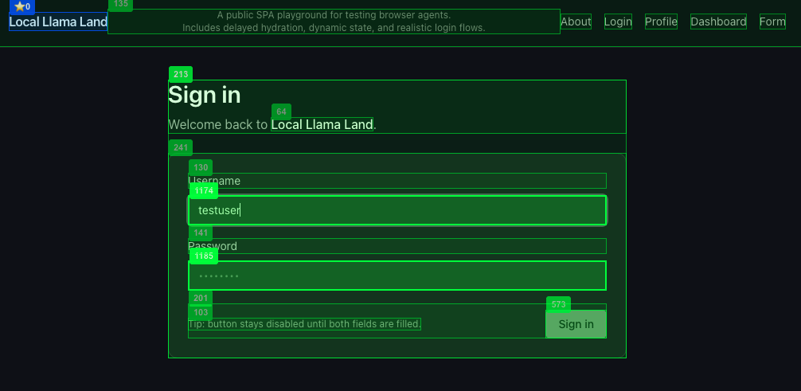

# Predicate Snapshot Skill for OpenClaw

ML-powered DOM pruning that reduces browser prompt tokens by **up to 99.8%** while preserving actionable elements.

## Overview

This OpenClaw skill replaces the default accessibility tree snapshot with Predicate's ML-ranked DOM elements. Instead of sending 800+ elements (~18,000 tokens) to the LLM, it sends only the 50 most relevant elements (configurable) (~500 tokens).

### Real-World Demo Results

Tested with the included demo (`npm run demo`):

| Site | OpenClaw Snapshot (A11y Tree) | Predicate Snapshot | Savings |
|------|-----------|-----------|---------|
| slickdeals.net | 598,301 tokens (24,567 elements) | 1,283 tokens (50 elements) | **99.8%** |
| news.ycombinator.com | 16,484 tokens (681 elements) | 587 tokens (50 elements) | **96%** |
| example.com | 305 tokens (12 elements) | 164 tokens (4 elements) | **46%** |
| httpbin.org/html | 1,590 tokens (34 elements) | 164 tokens (4 elements) | **90%** |
| **Total** | **616,680 tokens** | **2,198 tokens** | **99.6%** |

> Ad-heavy sites like slickdeals.net show the most dramatic savings—from 598K tokens down to just 1.3K tokens. Simple pages like example.com have minimal elements, so savings are lower.

### Why Fewer Elements Is Better

You might wonder: "Isn't 50 elements vs 24,567 elements comparing apples to oranges?"

**No—and here's why:**

1. **Most elements are noise.** Of those 24,567 elements on slickdeals.net, the vast majority are:
   - Ad iframes and tracking pixels
   - Hidden elements and overlays
   - Decorative containers (`<div>`, `<span>`)
   - Non-interactive text nodes
   - Duplicate/redundant elements

2. **LLMs need actionable elements and enough context to reason.** For browser automation, the agent needs to:
   - Click buttons and links
   - Fill form fields
   - Read key content for decision-making

   Predicate's ML ranking identifies the ~50 most relevant elements—including both interactive controls and contextual text—while filtering out the noise.

3. **More elements = worse performance.** Sending 600K tokens to an LLM causes:
   - Higher latency (slower responses)
   - Higher cost ($11K+/month vs $5/month)
   - Context window overflow on complex pages
   - More hallucinations from irrelevant context

4. **Quality over quantity.** Predicate's snapshot includes:
   - ML-ranked importance scores
   - Dominant group detection (for ordinal tasks like "click 3rd item")
   - Visual cues (is_primary, position)
   - Semantic role information

   This structured context helps LLMs make better decisions than a raw element dump.

**The goal isn't to preserve all elements—it's to preserve the right elements.**

### Proven in Production

- **Small local LLM model (3B) success**: The Predicate Snapshot engine powered a complex browser automation task using only a 3B parameter local model—[featured on Hacker News front page](https://news.ycombinator.com/item?id=46790127)
- **Deep dive**: Read why the accessibility tree alone isn't enough for web automation: [Why A11y Alone Isn't Enough](https://predicatesystems.ai/blog/why-ax-alone-isnt-enough)

### Summary

| Approach | Tokens (avg) | Elements | Signal Quality |
|----------|--------|----------|----------------|
| Accessibility Tree | ~150,000+ | ~6,000+ | Low (noise) |
| Predicate Snapshot | ~500-1,300 | 50 | High (ML-ranked) |

## Quick Start

### 1. Install the Skill

**Via ClawHub (Recommended):**
```bash
npx clawdhub@latest install predicate-snapshot
```

**Manual Installation:**
```bash
git clone https://github.com/PredicateSystems/openclaw-predicate-skill ~/.openclaw/skills/predicate-snapshot
cd ~/.openclaw/skills/predicate-snapshot
npm install
npm run build
```

### 2. Get Your API Key

1. Go to [PredicateSystems.ai](https://www.PredicateSystems.ai)
2. Sign up for a **free account (includes 500 free credits/month)**
3. Navigate to **Dashboard > API Keys**
4. Click **Create New Key** and copy your key (starts with `sk-...`)

### 3. Configure the API Key

**Option A: Environment Variable (Recommended)**
```bash
# Add to your shell profile (~/.bashrc, ~/.zshrc, etc.)
export PREDICATE_API_KEY="sk-your-key-here"
```

**Option B: OpenClaw Config File**

Add to `~/.openclaw/config.yaml`:
```yaml
skills:
  predicate-snapshot:
    api_key: "sk-your-key-here"
    max_credits_per_session: 100  # Optional: limit credits per session
```

### 4. Verify Installation

```bash
# In OpenClaw, run:
/predicate-snapshot
```

If configured correctly, you'll see a ranked list of page elements.

## How It Works

### Does This Replace the Default A11y Tree?

**No, this skill does not automatically replace OpenClaw's default accessibility tree.** Instead, it provides an alternative snapshot command that you can use when you want better element ranking.

| Command | What It Does |
|---------|--------------|
| Default OpenClaw | Uses raw accessibility tree (~18,000 tokens) |
| `/predicate-snapshot` | Uses ML-ranked Predicate snapshot (~500 tokens) |
| `/predicate-snapshot-local` | Uses local heuristic ranking (free, no API) |

**To use Predicate snapshots in your workflow:**
1. Use `/predicate-snapshot` instead of the default page observation
2. Use `/predicate-act click <ID>` to interact with elements by their ID
3. The element IDs from Predicate snapshots work with `/predicate-act`

**Future:** OpenClaw may add configuration to set Predicate as the default snapshot provider.

## Usage

### Capture Snapshot

```
/predicate-snapshot [--limit=50] [--include-ordinal]
```

Returns a pipe-delimited table of ranked elements:

```
ID|role|text|imp|is_primary|docYq|ord|DG|href
42|button|Add to Cart|0.95|true|320|1|cart-actions|
15|button|Buy Now|0.92|true|340|2|cart-actions|
23|link|Product Details|0.78|false|400|0||/dp/...
```

### Execute Actions

```bash
/predicate-act click 42        # Click element by ID
/predicate-act type 15 "query" # Type into element
/predicate-act scroll 23       # Scroll to element
```

### Local Mode (Free)

```
/predicate-snapshot-local [--limit=50]
```

Uses heuristic ranking without ML API calls. Lower accuracy but no credits consumed.

## Example Workflow

```
1. /predicate-snapshot              # Get ranked elements
2. /predicate-act click 42          # Click "Add to Cart"
3. /predicate-snapshot              # Refresh after action
4. Verify cart updated
```

## Output Format

| Column | Description |
|--------|-------------|
| ID | Unique element identifier for `/predicate-act` |
| role | ARIA role (button, link, textbox, etc.) |
| text | Visible text content (truncated to 30 chars) |
| imp | Importance score (0.0-1.0, ML-ranked) |
| is_primary | Whether element is a primary action |
| docYq | Vertical position in document |
| ord | Ordinal within dominant group |
| DG | Dominant group identifier |
| href | Link URL if applicable |

Each ML-powered snapshot consumes 1 credit. Local snapshots are free.

## Development

### Run Demo

Compare token usage between accessibility tree and Predicate snapshot:

Get free credits for testing at https://www.PredicateSystems.ai

```bash
# With API key (REAL ML-ranked snapshots)
PREDICATE_API_KEY=sk-... npm run demo

# Without API key (uses extension's local ranking)
npm run demo
```

Example output:
```
======================================================================
 TOKEN USAGE COMPARISON: Accessibility Tree vs. Predicate Snapshot
======================================================================
 Mode: PredicateBrowser with extension loaded
 Snapshots: REAL (API key detected)
======================================================================

Analyzing: https://news.ycombinator.com
  Capturing accessibility tree...
  Capturing Predicate snapshot (REAL - ML-ranked via API)...

======================================================================
 RESULTS
======================================================================

news.ycombinator.com (REAL)
  +---------------------------------------------------------+
  | Accessibility Tree:   16,484 tokens (681 elements)      |
  | Predicate Snapshot:      587 tokens (50 elements)       |
  | Savings:                  96%                           |
  +---------------------------------------------------------+

======================================================================
 TOTAL: 616,680 -> 2,198 tokens (99.6% reduction)
======================================================================

 MONTHLY COST PROJECTION (5,000 tasks × 5 snapshots = 25,000 snapshots)
   Accessibility Tree: $11,562.75 (LLM tokens only)
   Predicate Snapshot: $5.12 ($1.37 LLM + $3.75 API)
   Monthly Savings:    $11,557.63
```

### Run Login Demo (Multi-Step Workflow)

This demo demonstrates real-world browser automation with a **6-step login workflow**:

1. Navigate to login page and wait for delayed hydration
2. Fill username field (LLM selects element + human-like typing)
3. Fill password field (button state: disabled → enabled)
4. Click login button
5. Navigate to profile page
6. Extract username from profile card



*The Predicate overlay shows ML-ranked element IDs (green borders) that the LLM uses to select form fields.*

Target site: `https://www.localllamaland.com/login` - a test site with intentional challenges:
- **Delayed hydration**: Form loads after ~600ms (SPA pattern)
- **State transitions**: Login button disabled until both fields filled
- **Late-loading content**: Profile card loads after 800-1200ms

**Setup:**

1. Copy the example env file:
```bash
cp .env.example .env
```

2. Edit `.env` and add your OpenAI API key:
```bash
# .env
OPENAI_API_KEY=sk-your-openai-api-key-here

# Optional: for ML-ranked snapshots
PREDICATE_API_KEY=sk-your-predicate-api-key-here
```

3. Run the demo with visible browser and element overlay:
```bash
npm run demo:login -- --headed --overlay
```

**Alternative LLM providers:**
```bash
# Anthropic Claude
ANTHROPIC_API_KEY=sk-... npm run demo:login -- --headed --overlay

# Local LLM (Ollama)
SENTIENCE_LOCAL_LLM_BASE_URL=http://localhost:11434/v1 npm run demo:login -- --headed --overlay

# Headless mode (no browser window)
npm run demo:login
```

**Flags:**
- `--headed` - Run browser in visible window (not headless)
- `--overlay` - Show green borders around captured elements (requires `--headed`)

This demo compares A11y Tree vs Predicate Snapshot across **all 6 steps**, measuring:
- **Tokens per step**: Input size for each LLM call
- **Latency**: Time per step including form interactions
- **Success rate**: Step completion across the workflow

#### Key Observations

| Metric | A11y Tree | Predicate Snapshot | Delta |
|--------|-----------|-------------------|-------|
| **Steps Completed** | 3/6 (failed at step 4) | **6/6** | Predicate wins |
| **Token Savings** | baseline | **70-74% per step** | Significant |
| **SPA Hydration** | No built-in wait | **`check().eventually()` handles it** | More reliable |

**Why A11y Tree Failed at Step 4:**

The A11y (accessibility tree) approach failed to click the login button because:

1. **Element ID mismatch**: The A11y tree assigns sequential IDs based on DOM traversal order, which can change between snapshots as the SPA re-renders. The LLM selected element 47 ("Sign in"), but that ID no longer pointed to the button after form state changed.

2. **No stable identifiers**: Unlike Predicate's `data-predicate-id` attributes (injected by the browser extension), A11y IDs are ephemeral and not anchored to the actual DOM elements.

3. **SPA state changes**: After filling both form fields, the button transitioned from disabled → enabled. This state change can cause the A11y tree to re-order elements, invalidating the LLM's element selection.

**Predicate Snapshot succeeded because:**
- `data-predicate-id` attributes are stable across re-renders
- ML-ranking surfaces the most relevant elements (button with "Sign in" text)
- `runtime.check().eventually()` properly waits for SPA hydration

#### Raw Demo Logs

<details>
<summary>Click to expand full demo output</summary>

```
======================================================================
 LOGIN + PROFILE CHECK: A11y Tree vs. Predicate Snapshot
======================================================================
Using OpenAI provider
Model: gpt-4o-mini
Running in headed mode (visible browser window)
Overlay enabled: elements will be highlighted with green borders
Predicate snapshots: REAL (ML-ranked)
======================================================================

======================================================================
 Running with A11Y approach
======================================================================

[2026-02-25 01:14:50] Step 1: Wait for login form hydration
  Waiting for form to hydrate using runtime.check().eventually()...
  Button initially disabled: false
  PASS (11822ms) | Found 19 elements

[2026-02-25 01:15:02] Step 2: Fill username field
  Snapshot: 45 elements, 1241 tokens
  LLM chose element 37: "Username"
  PASS (6771ms) | Typed "testuser"
  Tokens: prompt=1241 total=1251

[2026-02-25 01:15:08] Step 3: Fill password field
  LLM chose element 42: "Password"
  Waiting for login button to become enabled...
  PASS (12465ms) | Button enabled: true
  Tokens: prompt=1295 total=1305

[2026-02-25 01:15:21] Step 4: Click login button
  LLM chose element 47: "Sign in"
  FAIL (7801ms) | Navigated to https://www.localllamaland.com/login
  Tokens: prompt=1367 total=1377

======================================================================
 Running with PREDICATE approach
======================================================================

[2026-02-25 01:15:29] Step 1: Wait for login form hydration
  Waiting for form to hydrate using runtime.check().eventually()...
  Button initially disabled: false
  PASS (10586ms) | Found 19 elements

[2026-02-25 01:15:40] Step 2: Fill username field
  Snapshot: 19 elements, 351 tokens
  LLM chose element 23: "username"
  PASS (12877ms) | Typed "testuser"
  Tokens: prompt=351 total=361

[2026-02-25 01:15:53] Step 3: Fill password field
  LLM chose element 25: "Password"
  Waiting for login button to become enabled...
  PASS (17886ms) | Button enabled: true
  Tokens: prompt=352 total=362

[2026-02-25 01:16:10] Step 4: Click login button
  LLM chose element 29: "Sign in"
  PASS (12690ms) | Navigated to https://www.localllamaland.com/profile
  Tokens: prompt=346 total=356

[2026-02-25 01:16:23] Step 5: Navigate to profile page
  PASS (1ms) | Already on profile page

[2026-02-25 01:16:23] Step 6: Extract username from profile
  Waiting for profile card to load...
  Found username: testuser@localllama.land
  Found email: Profile testuser testuser@localllama.lan
  PASS (20760ms) | username=testuser@localllama.land
  Tokens: prompt=480 total=480

======================================================================
 RESULTS SUMMARY
======================================================================

+-----------------------------------------------------------------------+
| Metric              | A11y Tree        | Predicate        | Delta     |
+-----------------------------------------------------------------------+
| Total Tokens        |             3933 |             1559 | -60%      |
| Total Latency (ms)  |            38859 |            74800 | +92%      |
| Steps Passed        |              3/6 |              6/6 |           |
+-----------------------------------------------------------------------+

Key Insight: Predicate snapshots use 60% fewer tokens
for a multi-step login workflow with form filling.

Step-by-step breakdown:
----------------------------------------------------------------------
Step 1: Wait for login form hydration
  A11y: 0 tokens, 11822ms, PASS
  Pred: 0 tokens, 10586ms, PASS (0% savings)
Step 2: Fill username field
  A11y: 1251 tokens, 6771ms, PASS
  Pred: 361 tokens, 12877ms, PASS (71% savings)
Step 3: Fill password field
  A11y: 1305 tokens, 12465ms, PASS
  Pred: 362 tokens, 17886ms, PASS (72% savings)
Step 4: Click login button
  A11y: 1377 tokens, 7801ms, FAIL
  Pred: 356 tokens, 12690ms, PASS (74% savings)
```

</details>

#### Summary

| Step | A11y Tree | Predicate Snapshot | Token Savings |
|------|-----------|-------------------|---------------|
| Step 1: Navigate to localllamaland.com/login | PASS | PASS | - |
| Step 2: Fill username | 1,251 tokens, PASS | 361 tokens, PASS | **71%** |
| Step 3: Fill password | 1,305 tokens, PASS | 362 tokens, PASS | **72%** |
| Step 4: Click login | 1,377 tokens, **FAIL** | 356 tokens, PASS | **74%** |
| Step 5: Navigate to profile | (not reached) | PASS | - |
| Step 6: Extract username | (not reached) | 480 tokens, PASS | - |
| **Total** | **3,933 tokens, 3/6 steps** | **1,559 tokens, 6/6 steps** | **60%** |

> **Key Insight:** Predicate Snapshot not only reduces tokens by 70%+ per step, but also **improves automation reliability** on SPAs with automatic wait for hydration via `runtime.check().eventually()`. The stable element IDs survive React/Next.js re-renders that break A11y tree-based approaches.

### Build

```bash
npm run build
```

### Test

```bash
npm test
```

## Architecture

```
predicate-snapshot-skill/
├── src/
│   ├── index.ts      # MCP tool definitions
│   ├── snapshot.ts   # PredicateSnapshotTool implementation
│   └── act.ts        # PredicateActTool implementation
├── demo/
│   ├── compare.ts    # Token comparison demo
│   ├── llm-action.ts # Simple LLM action demo (single clicks)
│   └── login-demo.ts # Multi-step login workflow demo
├── SKILL.md          # OpenClaw skill manifest
└── package.json
```

## Dependencies

- `@predicatesystems/runtime` - Predicate SDK with PredicateContext
- `playwright` (peer) - Browser automation

## License

(MIT OR Apache-2.0)

## Support

- Documentation: [predicatesystems.ai/docs](https://predicatesystems.ai/docs)
- Issues: [GitHub Issues](https://github.com/PredicateSystems/openclaw-predicate-skill/issues)

## Why Predicate Snapshot Over Accessibility Tree?

OpenClaw and similar browser automation frameworks default to the **Accessibility Tree (A11y)** for navigating websites. While A11y works for simple cases, it has fundamental limitations that make it unreliable for production LLM-driven automation:

### A11y Tree Limitations

| Problem | Description | Impact on LLM Agents |
|---------|-------------|----------------------|
| **Optimized for Consumption, Not Action** | A11y is designed for assistive technology (screen readers), not action verification or layout reasoning | Lacks precise semantic geometry and ordinality (e.g., "the first item in a list") that agents need for reliable reasoning |
| **Hydration Lag & Structural Inconsistency** | In JS-heavy SPAs, A11y often lags behind hydration or misrepresents dynamic overlays and grouping | Snapshots miss interactive nodes or incorrectly label states (e.g., confusing `focused` with `active`) |
| **Shadow DOM & Iframe Blind Spots** | A11y struggles to maintain global order across Shadow DOM and iframe boundaries | Cross-shadow ARIA delegation is inconsistent; iframe contents are often missing or lose spatial context |
| **Token Inefficiency** | Extracting the entire A11y tree for small actions wastes context window and compute | Superfluous nodes (like `genericContainer`) consume tokens without helping the agent |
| **Missing Visual/Layout Bugs** | A11y trees miss rendering-time issues like overlapping buttons or z-index conflicts | Agent reports elements as "correct" but cannot detect visual collisions |

### Predicate Snapshot Advantages

| Capability | How Predicate Solves It |
|------------|------------------------|
| **Post-Rendered Geometry** | Layers in actual bounding boxes and grouping missing from standard A11y representations |
| **Live DOM Synchronization** | Anchors on the live, post-rendered DOM ensuring perfect sync with actual page state |
| **Unified Cross-Boundary Grounding** | Rust/WASM engine prunes and ranks elements across Shadow DOM and iframes, maintaining unified element ordering |
| **Token-Efficient Pruning** | Specifically prunes uninformative branches while preserving all interactive elements, enabling 3B parameter models to perform at larger model levels |
| **Deterministic Verification** | Binds intent to deterministic outcomes via snapshot diff, providing an auditable "truth" layer rather than just a structural "report" |

> **Bottom Line:** A11y trees tell you what *should* be there. Predicate Snapshots tell you what *is* there—and prove it.
